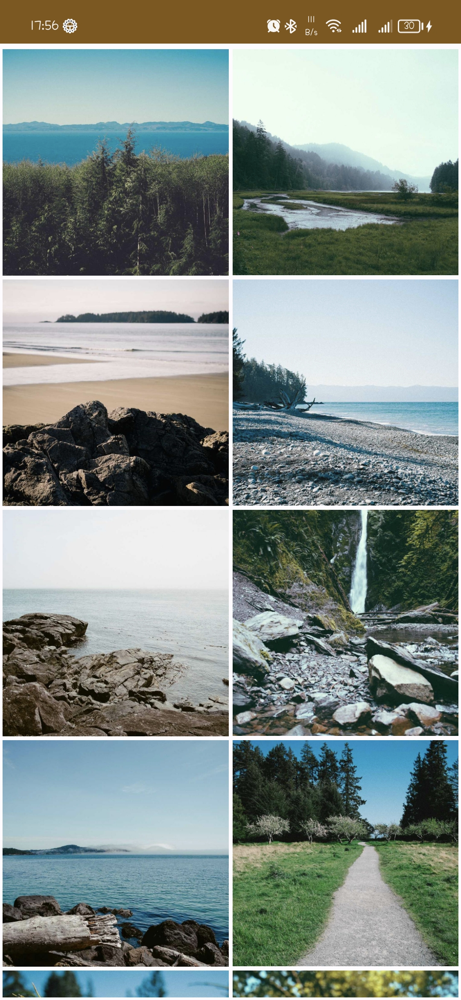
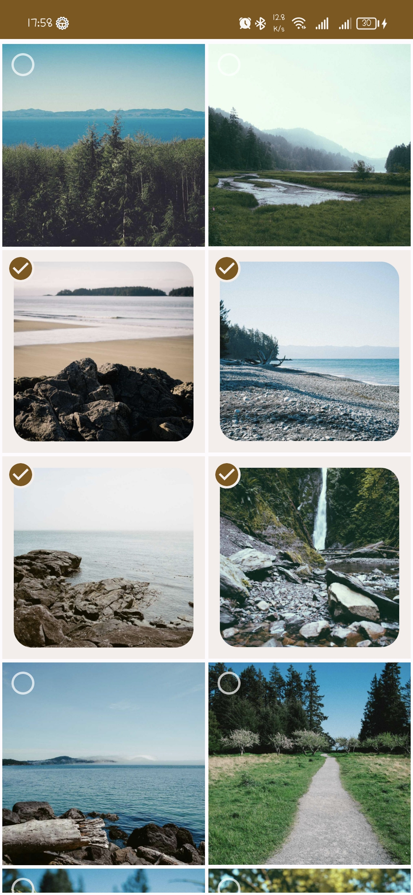
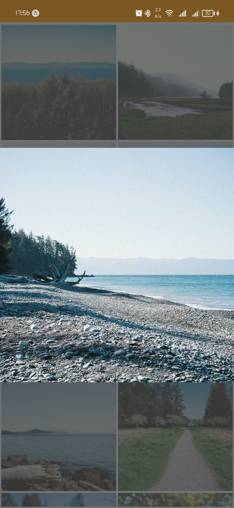

# Unsplash
Albums is a native Android mobile application that uses Kotlin Programming Language to get images from unsplash.com.

## Application Features:
* Get images from splash.com.
* Brows images.
* Select images and zoom.

## Tools used
* Kotlin.
* Jetpack Compose.
* Material Design 3.
* Retrofit.
* Hilt Dependency Injection.
* Coroutines.
* Coil.
* MVVM Architecture Pattern.

## Downloads
[APK Download](https://drive.google.com/file/d/1Tgdb9KgC8R7wcShmQxYZeOsQMfqLY_5t/view?usp=sharing)

## Screenshots

  
  
  

